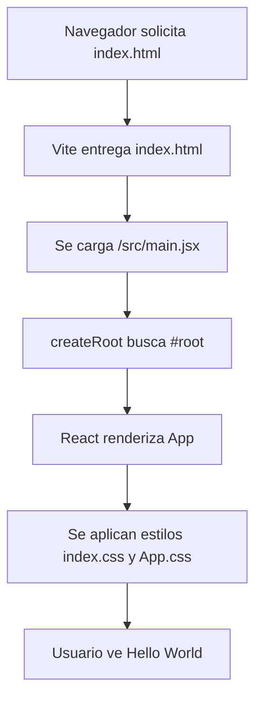

# App Hello World con React + Vite

Este proyecto es una SPA (Single Page Application) creada con React y empaquetada con Vite.

## Arquitectura general

La cadena de arranque es la siguiente:

1. index.html crea el contenedor raiz.
2. src/main.jsx monta React en ese contenedor.
3. src/App.jsx define el componente principal Hello World.
4. src/index.css y src/App.css aplican estilos globales y del componente.

### Diagrama simple del flujo de arranque

## Explicacion archivo por archivo

1. package.json

Define el proyecto y sus scripts:
- dev: inicia servidor de desarrollo de Vite.
- build: genera version optimizada para produccion.
- lint: analiza calidad de codigo con ESLint.
- preview: sirve localmente el build.

Tambien declara dependencias:
- Runtime: react, react-dom.
- Desarrollo: vite, plugin de React, eslint y plugins.

2. package-lock.json

Congela versiones exactas del arbol de dependencias para reproducibilidad.

3. vite.config.js

Configura Vite con el plugin oficial de React.
Su rol es habilitar JSX, Fast Refresh y el pipeline de build.

4. index.html

Plantilla HTML base.
Puntos clave:
- Incluye el div con id root, donde React toma control del DOM.
- Carga el script de entrada en /src/main.jsx.

5. src/main.jsx

Bootstrap de React:
- Importa StrictMode.
- Crea el root con createRoot.
- Renderiza App dentro del root.

StrictMode ayuda a detectar malas practicas en desarrollo.

6. src/App.jsx

Componente principal de la solucion.
Actualmente muestra:
- Titulo Hello World.
- Mensaje React + Vite funcionando.

7. src/App.css

Estilos del componente App:
- Centrado vertical y horizontal.
- Tipografia responsiva para el titulo con clamp.
- Espaciado y estilo del texto secundario.

8. src/index.css

Estilos globales:
- Tipografia base.
- Fondo global con gradiente.
- box-sizing global.
- Normalizacion minima del body.

9. eslint.config.js

Configuracion de lint:
- Reglas recomendadas de JavaScript.
- Reglas de React Hooks.
- Reglas para React Refresh en Vite.
- Ignora la carpeta dist.

10. .gitignore

Evita versionar archivos generados o temporales:
- node_modules
- dist
- logs
- archivos locales del editor o sistema

11. README.md

Documentacion principal del proyecto.
Este archivo ahora describe la arquitectura y cada parte de la solucion.

12. public/favicon.svg y public/icons.svg

Assets estaticos servidos directamente por Vite.

13. src/assets/react.svg, src/assets/vite.svg y src/assets/hero.png

Assets importables desde componentes.
En esta version final de Hello World no se usan, pero quedaron de la plantilla base.

14. dist

Salida compilada para produccion, generada por el comando build.
No se edita manualmente.

15. node_modules

Dependencias instaladas localmente.
No se sube al repositorio.

## Componente principal en terminos de Ingenieria Web

El unico componente funcional de negocio en esta entrega es App en src/App.jsx.
Es una version minima y valida para comprobar:
- toolchain
- renderizado
- estilos

## Comandos utiles

- npm install
- npm run dev
- npm run build
- npm run preview
